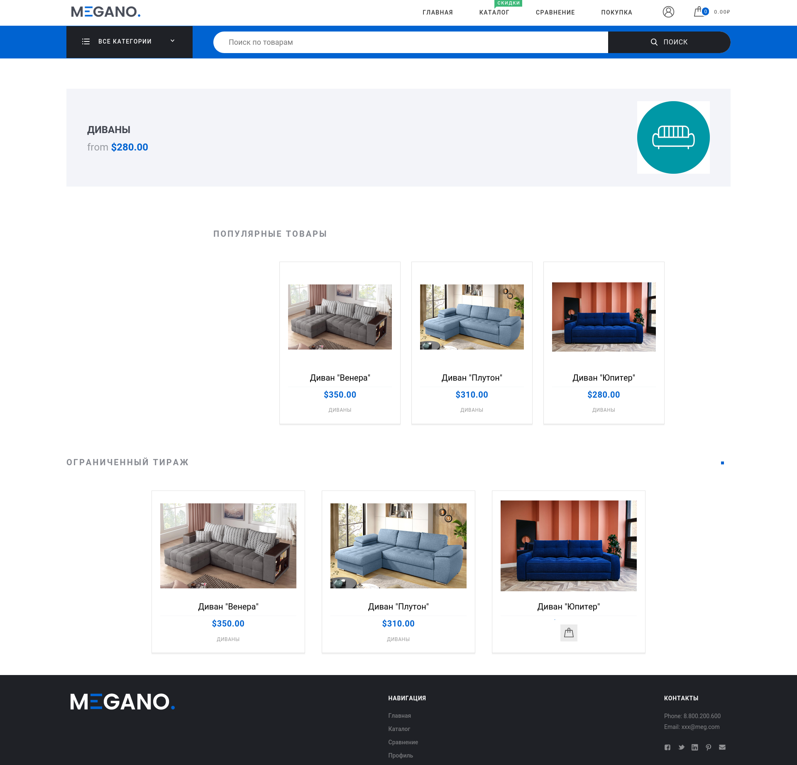
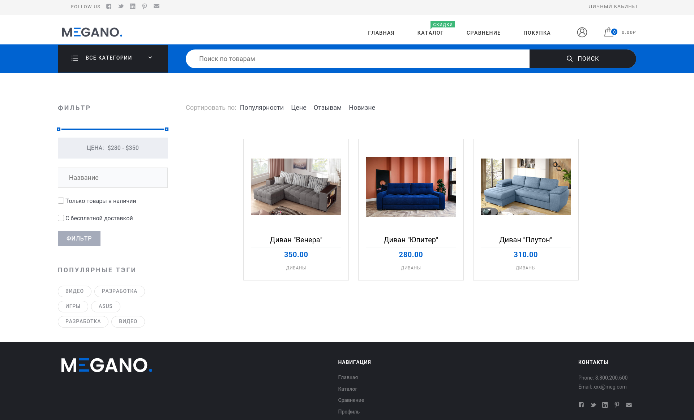
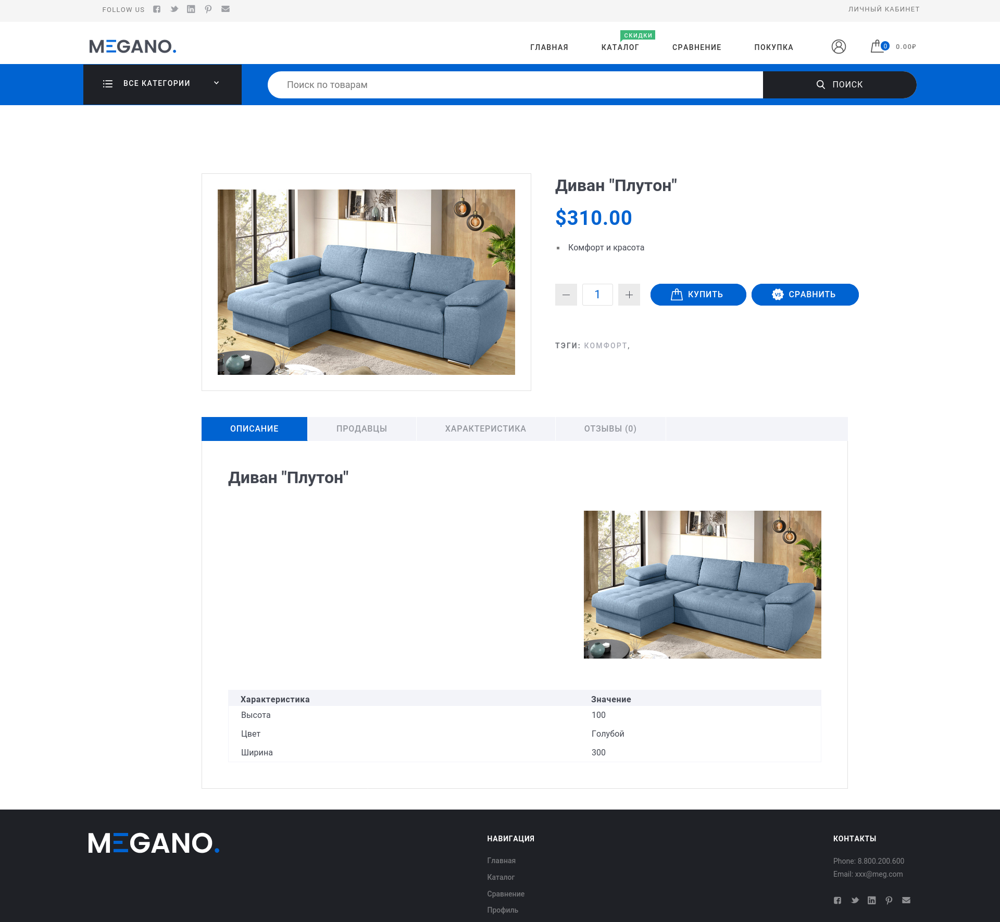
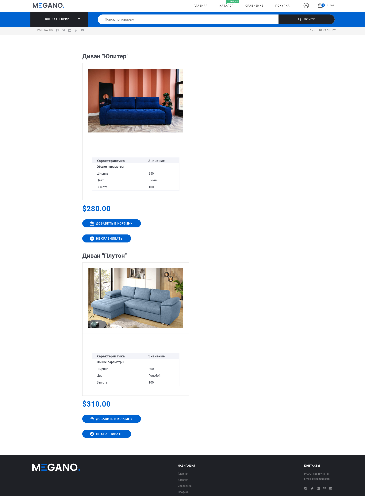

# MEGANO
Исполнитель: **Командный проект**

-------------------------------------------------------------------------------------

## Содержание
1. [Описание](#описание-проекта)
2. [Установка](#установка-и-запуск)
3. [Скриншоты](#скриншоты-работающего-приложения)
4. [Инструменты](#используемые-инструменты)
5. [Контакты](#контакты)

## Описание проекта
MEGANO - это онлайн магазин, разработанный на Django, который предоставляет пользователям возможность удобно совершать покупки. Это командный проект, в котором реализованы основные функции для управления товарами и взаимодействия с пользователями.

Возможности пользователя:
- Просмотр и сравнение товаров
- Покупка товаров
- Доступ к специальным предложениям и баннерам

### Админ Панель
В админ панели доступны следующие функции:
- Создание и управление товарами
- Добавление и редактирование продавцов
- Настройка баннеров для акций
- Управление заказами и пользователями


## Установка и запуск
### Шаг 1: Предварительная настройка
Перед использованием приложения убедитесь, что на Вашем устройстве (Linux-based OS) установлен **Docker 28.0.1**

### Шаг 2: Клонируйте репозиторий
Клонируйте github репозиторий на Ваше устройство:
```bash
git https://github.com/ykozhanov/Django-OnlineShopping.git
```

### Шаг 3: Настройка переменных окружения
- Перейдите в директорию с репозиторием:
```bash
cd Django-OnlineShopping
```
- Создайте `.env` файл с переменными. Для примера используйте `.env-example` из репозитория.

### Шаг 4: Docker-Compose
- Для запуска выполните в терминале: 
```bash 
docker compose up
```
Докер создаст суперпользователя с email и паролем указанными в `.env`


## Скриншоты приложения
**Главная страница**


***

**Товары в категории**


***

**Информация о товаре**


***

_**Сравнение товаров**_


***


## Используемые инструменты
- [Python](https://www.python.org/) как основной язык программирования;
- [Django](https://www.djangoproject.com/) как веб-фреймворк;
- [PostreSQL](https://www.postgresql.org/) как база данных;
- [Django ORM](https://docs.djangoproject.com/en/5.1/topics/db/queries/) как ORM инструмент;
- [Celery](https://docs.celeryq.dev/) как инструмент выполнения фоновых задач;
- [Redis](https://github.com/redis/redis) как брокер сообщений для фоновых задач;
- [Docker](https://www.docker.com/) для контейнеризации приложения.


## Контакты
По вопросам проекта и другим вопросам связанным с используемыми в проекте инструментам 
можно писать на почту `ykozhanov97@gmail.com`
